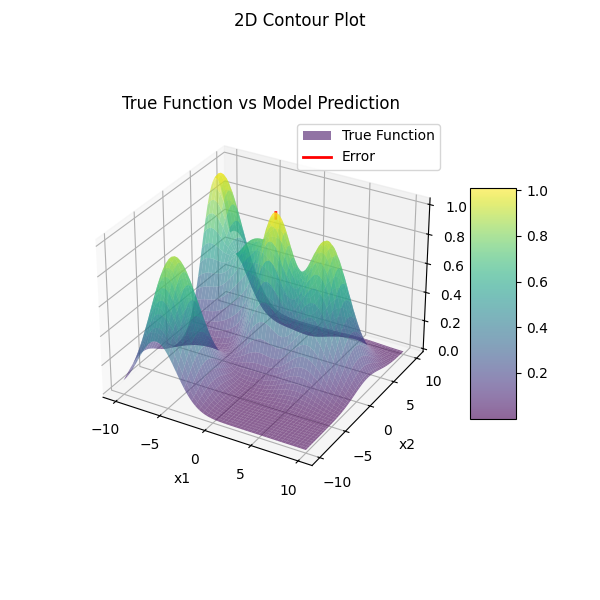

# Introduction 

Reinforce Learning can solve such a problem in physics:
- The problem contain a simulation process;
- The simulation process is a blackbox and has high computational cost;
- The function of simulation process is probably highly non-linear and highly dimensional. Traditional Optimization Algorithm may be unefficient.

In this case, we propose a new method combined RL and Optimization Algorithm:
- Agent: The Model itself;
- Action: Use Traditional Optimization Algorithm on the model to guess optimal position;
- Environment: The simulation code;
- Reward: The Loss between optimal prediction and simulation code output of optimal position.

In our codes, we use a "blackbox" function (consisted with different normal distributions) to replace the simulation process, hence an important evaluation is the number of calls of the function.

Obviously, RL method has no ability to jump out of the minima -  it can be solved by combined the Traditional Optimization Algorithm with RL method. In this code, we use a large initial population to ensure a rough cognition of the simulation code.

# Result
## 1D
1D curve:

.png)

Average of 100 circles:
_of_100_cirs.png)

## 2D
2D surface:

.png)

Average of 10 circles:
_of_10_cirsurve.png)

## 3D

.png)

